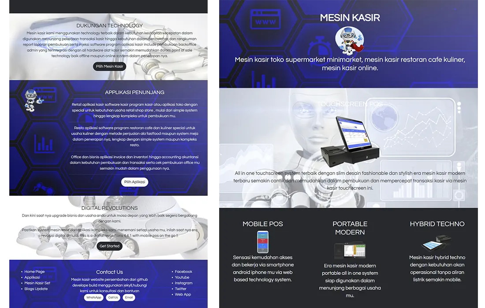
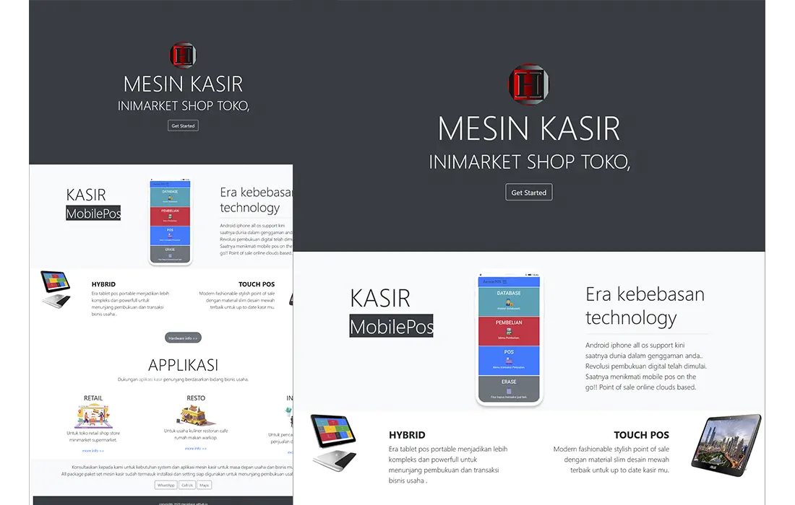
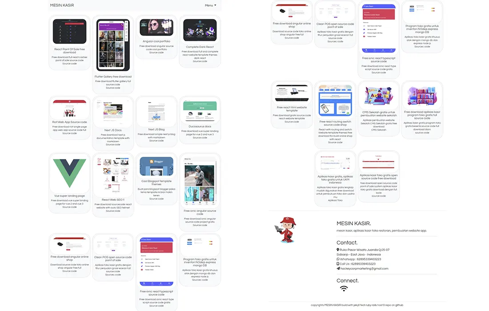
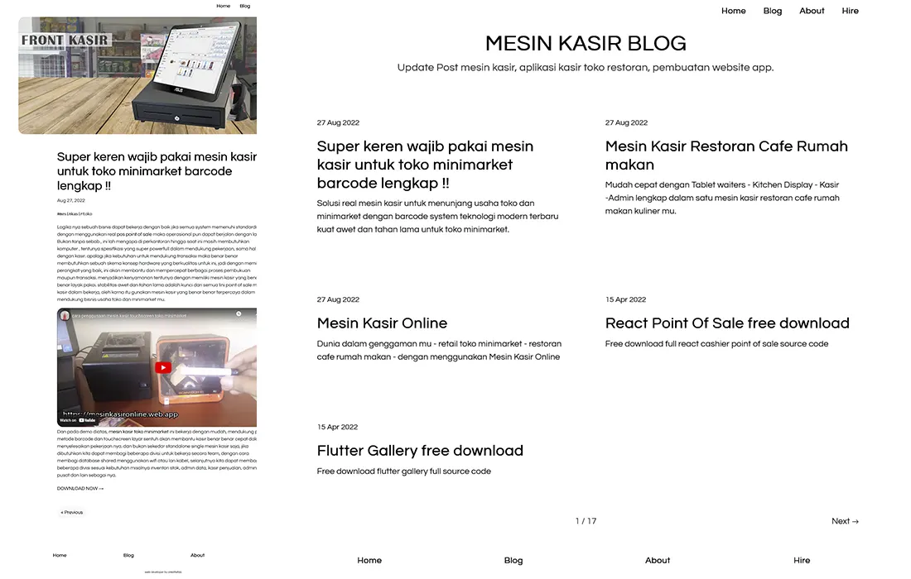

# JEKYLL MULTI THEMES

Jekyll Themes 1 

Run demo [https://mesinkasir.github.io/](https://mesinkasir.github.io/)

Jekyll Themes 2

Run demo [https://mesinkasir.github.io/oldschool](https://mesinkasir.github.io/oldschool)

Jekyll Themes 3

Run demo [https://mesinkasir.github.io/start.html](https://mesinkasir.github.io/start.html)

Jekyll Themes 4

Run demo [https://mesinkasir.github.io/alatkasir.html](https://mesinkasir.github.io/alatkasir.html)

Jekyll Themes 5

Run demo [https://mesinkasir.github.io/sourcecodefree/](https://mesinkasir.github.io/sourcecodefree/)

Jekyll Themes 6

Clean blog version 

Run demo [https://mesinkasir.github.io/blog](https://mesinkasir.github.io/blog)

---------------

Clone and run 🚀 :

`git clone https://github.com/mesinkasir/mesinkasir.github.io.git`

`bundle install`

`bundle exec jekyll serve` or `jekyll serve`

open `localhost:4000`

---------------

Developer 👩🏻‍🚀 : [https://www.fiverr.com/creativitas/design-your-modern-website-using-jekyll](https://www.fiverr.com/creativitas/design-your-modern-website-using-jekyll)